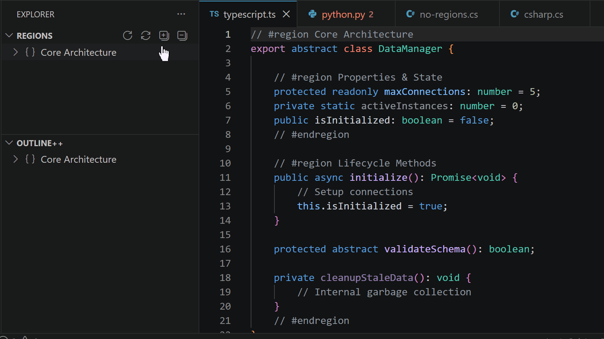

<!-- markdownlint-disable no-inline-html -->

# Outline++

A Visual Studio Code extension for navigating, visualizing, and managing code regions and document outlines. Forked from [Region Helper](https://github.com/alythobani/vscode-region-helper) (see [Acknowledgements](#acknowledgements)).

## Features

-  **Regions View** – Interactive tree for viewing and navigating regions.
-  **Outline++ View** – Like VS Code's built-in Outline view, but incorporates regions and modifiers.
-  **Modifier-Aware Icons** – Color-coded icons showing visibility and member modifiers for C++, C#, Java, TypeScript, Python, and more.
-  **Quick Navigation** – Jump, search, and select regions with commands and keyboard shortcuts.
-  **Diagnostics** – Detects unmatched region boundaries.
-  **Refresh & Debug** – Manual refresh buttons and built-in debug logging for diagnosing issues.

## Keybindings (Hotkeys)

| Action | Windows / Linux | macOS |
|--------|-----------------|-------|
| Go to Region… (quick pick) | `Ctrl + Alt + R` | `Cmd + Alt + R` |
| Go to Region Boundary | `Alt + M` | `Alt + M` |
| Go to Next Region | `Ctrl + Alt + N` | `Ctrl + Alt + N` |
| Go to Previous Region | `Ctrl + Alt + P` | `Ctrl + Alt + P` |
| Select Current Region | `Alt + Shift + M` | `Alt + Shift + M` |

> All shortcuts are active when the editor has focus, and can be remapped in VS Code's **Keyboard Shortcuts** editor.

## Table of Contents

1. [Features](#features)
2. [Table of Contents](#table-of-contents)
3. [Detailed Features](#detailed-features)
   1. [Regions View](#regions-view)
   2. [Outline++ View](#full-outline-view)
   3. [Modifier-Aware Icons](#modifier-aware-icons)
   4. [Region Diagnostics](#region-diagnostics)
   5. [Go to Region...](#go-to-region)
   6. [Go to Region Boundary](#go-to-region-boundary)
   7. [Go to Next / Previous Region](#go-to-next-previous-region)
   8. [Select Current Region](#select-current-region)
4. [Settings](#settings)
   1. [Show/Hide Views](#show-hide-views)
   2. [Toggling Auto-Highlighting in Tree Views](#toggling-auto-highlighting)
   3. [Modifier Display Settings](#modifier-display-settings)
   4. [Custom Region Patterns](#custom-region-patterns)
5. [Troubleshooting](#troubleshooting)
   1. [Manual Refresh](#manual-refresh)
   2. [Debug Logging](#debug-logging)
6. [Known Limitations](#known-limitations)
7. [Acknowledgements](#acknowledgements)

## Detailed Features

### Regions View

- Tree view of all regions in the current editor.
- Highlights the cursor’s active region (this can be toggled with commands/settings).
- Click a region to jump to it in the editor.

### Outline++ View

- Merges the VS Code `Outline` and `Regions` views.
- Highlights the cursor’s location.
- Click any item to jump to it in the editor.

### Modifier-Aware Icons

The Outline++ view can display color-coded icons that indicate the visibility and characteristics of symbols — similar to Visual Studio's Document Outline.

Additional modifier icons:
   - 🔒 for private/private-protected members
   - 🛡️ for protected/protected-internal members  
   - ˢ for static members

#### Color Legend

| Color | Meaning |
|-------|---------|
| 🟢 Green | `public` |
| 🔴 Red | `private` |
| 🟡 Yellow | `protected` |
| 🔵 Blue | `internal` / `package` |
| 🟠 Orange | `protected internal` |
| 🟣 Purple | `private protected` |

#### Supported Languages

| Language | Visibility Modifiers | Member Modifiers |
|----------|---------------------|------------------|
| **C#** | `public`, `private`, `protected`, `internal`, `protected internal`, `private protected` | `static`, `readonly`, `const`, `abstract`, `virtual`, `override`, `async`, `sealed`, `extern`, `volatile`, `new` |
| **Java** | `public`, `private`, `protected` | `static`, `final`, `abstract`, `volatile`, `sealed` |
| **Kotlin** | `public`, `private`, `protected`, `internal` | `const`, `val`, `abstract`, `override`, `sealed` |
| **TypeScript/JS** | `public`, `private`, `protected` | `static`, `readonly`, `const`, `abstract`, `async`, `override` |
| **C/C++** | `public`, `private`, `protected` | `static`, `const`, `constexpr`, `virtual`, `override`, `volatile`, `extern` |
| **Python** | (via naming conventions: `_name` = protected, `__name` = private) | `@staticmethod`, `@classmethod`, `@abstractmethod`, `async` |

#### Display Modes

Controlled by `outlinePlus.fullOutlineView.modifierDisplay`:

| Mode | Behavior |
|------|----------|
| `"off"` | Standard VS Code symbol icons only |
| `"colorOnly"` | Icon colors reflect visibility |
| `"colorAndBadge"` | Colors + emoji badge prefixes on labels (default) |
| `"colorAndSvgOverlay"` | Colors + overlay icons for methods/fields/properties |
| `"colorAndDescription"` | Colors + text descriptions to the right of symbol names (e.g., "static", "readonly") |

> **Tooltips** are always enhanced to show `[modifier list] SymbolName: line range`, regardless of display mode.

### Region Diagnostics

- Detects unmatched region boundaries and adds warnings in both the editor (squiggles) and the Problems panel, helping you catch incomplete or broken regions quickly.

### Go to Region...

- Like VS Code’s built-in **"Go to Symbol..."**, but for regions: Opens a fuzzy-searchable dropdown to jump to any region in the current file.  **Default Keybinding**:
  - **Windows/Linux**: `Ctrl + Alt + R`
  - **Mac**: `Cmd + Alt + R`

### Go to Region Boundary

- Like VS Code’s built-in **"Go to Bracket"**, but for regions:
  - Jumps between matching start and end region boundaries.
  - Jumps to the next region if the cursor is not already inside a region.
- **Default Keybinding**: `Alt + M`

### Go to Next / Previous Region

- Jumps to the next or previous region in the file. **Default Keybindings**:
  - **Next Region**: `Ctrl + Alt + N`
  - **Previous Region**: `Ctrl + Alt + P`

### Select Current Region

- Selects the active region containing the cursor.
- **Default Keybinding**: `Alt + Shift + M`

## Settings

### Show/Hide Views

Both the **Regions** and **Outline++** views behave like the built-in **Outline** and **Timeline** views: they're always available from the Explorer's right-click "Views" menu, where you can show or hide them. When the active document has nothing to show (no regions, or no outline symbols), the view displays a brief placeholder message instead of disappearing.

### Toggling Auto-Highlighting in Tree Views

- By default, the Regions and Outline++ views will highlight the cursor's active region or symbol as you navigate the editor.
- To toggle this feature:
  - Use the `{Stop/Start} Auto-Highlighting Active {Region/Item}` commands, or
  - Click the `🔄` icon in the tree view's title bar.

### Modifier Display Settings

Settings under `outlinePlus.fullOutlineView`:

| Setting | Type | Default | Description |
|---------|------|---------|-------------|
| `modifierDisplay` | string | `"colorAndBadge"` | Controls how modifiers are displayed. Values: `"off"`, `"colorOnly"`, `"colorAndBadge"`, `"colorAndSvgOverlay"`, `"colorAndDescription"` |
| `useDistinctModifierColors` | boolean | `true` | Use distinct colors (green=public, red=private, yellow=protected) vs subtle symbol-themed colors |

### Custom Region Patterns

- **Supports 50+ languages** out of the box, including:
  - **C, C++, C#, Java, Python, JavaScript, JSX, TypeScript, TSX, PHP, Ruby, Swift, Go, Rust, HTML, XML, Markdown, JSON/JSONC, YAML, SQL, and more**.
- Define custom region patterns, or adjust the existing default patterns, to customize how regions are parsed.  Setting: `outlinePlus.regionBoundaryPatternByLanguageId`

## Troubleshooting

### Manual Refresh

Both the **Regions** and **Outline++** views have a **Refresh** button (↻) in the view's title bar. Click it to force a complete re-fetch of all data, bypassing any caching or change-detection. You can also run the commands from the Command Palette:

- **Outline++: Refresh Regions View**
- **Outline++: Refresh Full Outline**

### Debug Logging

If the outline gets stuck or stops updating, you can capture diagnostic information:

1. **Enable debug logging**: Open Settings (`Ctrl+,`) → search for `outlinePlus.enableDebugLogging` → set to `true`.
2. **Reproduce the problem**.
3. **Dump diagnostic state**: Open the Command Palette (`Ctrl+Shift+P`) → run **Outline++: Dump Diagnostic State**. This opens the "Outline++" Output channel with a snapshot of all internal store state.
4. **Show the debug log**: Run **Outline++: Show Debug Log** to review the full timeline of state transitions.

The log captures editor switches, symbol fetches, discarded stale fetches, and version mismatches — all the data needed to diagnose refresh issues.

## Known Limitations

See [detailed limitations](./docs/LIMITATIONS.md) in docs.  Some salient limitations:

- **Go to Region...** only supports **camelCase matching** (not full fuzzy search) due to a [VS Code API limitation](https://github.com/microsoft/vscode/issues/34088#issuecomment-328734452).
- The  **Regions** and **Outline++** tree views **always highlight the cursor's last active item**, even when outside any region/symbol ([another VS Code API limitation](https://github.com/microsoft/vscode/issues/48754)).
- **Modifier extraction** relies on parsing the document text to match language-specific keyword patterns. It does not use the Language Server Protocol's symbol tags (which are not yet widely supported). This means modifier detection may be imperfect for complex or unusual code patterns.

## Acknowledgements

Outline++ builds on [vscode-region-helper](https://github.com/alythobani/vscode-region-helper) (GPL-3.0), forked 2025-11-30. The region-navigation features and tree views originated there.
